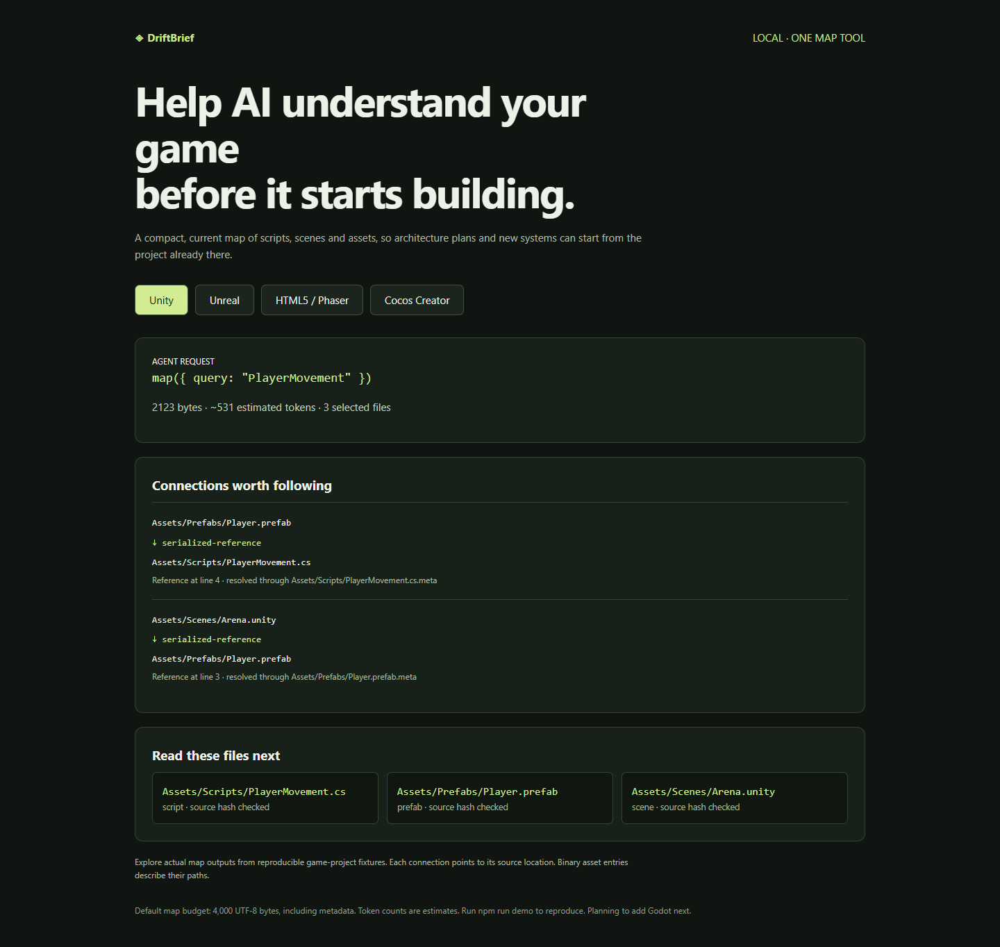

# DriftBrief

**Help AI understand how your game fits together before it starts building.**

AI can help plan systems and scaffold their foundations. DriftBrief gives coding agents a compact, automatically updated map of the existing game: scripts, scenes, prefabs, modules and assets.

[Try the map demo](https://krushnachaudhary.github.io/driftbrief/) · [Download the installer](https://github.com/KrushnaChaudhary/driftbrief/releases/download/v0.1.0-beta.2/driftbrief-install.mjs) · [Release files](https://github.com/KrushnaChaudhary/driftbrief/releases)



Local · MIT · Node.js 22 or 24 · One MCP tool · 4 KB default map

## Install once

Download `driftbrief-install.mjs`, open a terminal in your game project, and run:

```sh
node /path/to/driftbrief-install.mjs
```

The installer creates `.driftbrief/`, builds the first index and adds project integrations for Codex, Claude Code and Cursor. Restart your client and accept its native project/MCP trust prompt.

For the portable folder, run `node .driftbrief/run.mjs init`. Select clients with `--clients claude,cursor`. Repeated installation preserves existing settings.

For Codex CLI 0.154.0-alpha.6.2, start with `node .driftbrief/run.mjs launch codex` to supply the MCP settings for that session. [Client setup](docs/compatibility.md) documents each integration path.

## One map interface

```text
map()                           → compact project overview
map({ query: "PlayerMovement" }) → connected scripts, prefabs, scenes and assets
```

The agent follows the returned paths with its normal file tools. Every map request reconciles project files and checks selected text hashes; the connected MCP worker also refreshes in the background.

| Project | Connections |
|---|---|
| Unity | Scene/prefab references through .meta GUIDs, C# declarations, assemblies and declared package versions |
| Unreal | .uproject modules, Build.cs dependencies, header candidates, source/config asset paths and asset locations |
| HTML5 / Phaser | Local JS/TS imports, literal scene transitions and asset-loader paths |
| Cocos Creator | Exact scene/prefab UUID links through top-level .meta UUIDs |
| Other browser engines | JS/TS imports, literal paths and package detection for Pixi, Three, Babylon and Laya |

The adapters provide static project navigation. Binary assets have path/existence coverage; live editor state and Blueprint graph analysis belong to engine-connected tooling. Dynamic or ambiguous references appear in coverage metadata.

## Built to stay compact

- One agent tool with a 4,000-byte default response, including metadata.
- Two bounded relationship hops around the requested feature.
- Reuse of parsed data when source hashes match.
- Unity and Unreal generated directories excluded from indexing.
- Prompt-free map storage with three rolling index generations.
- Local operation using the existing coding client's MCP connection.
- Read-only access to game files, with reversible project integrations.

Source fingerprints record the bytes observed at verification time. Token estimates use UTF-8 bytes divided by four. Full resource bounds and data handling are in [architecture](docs/architecture.md).

## Check or remove

```sh
node .driftbrief/run.mjs map "PlayerMovement"
node .driftbrief/run.mjs doctor
node .driftbrief/run.mjs uninstall
```

Uninstall removes unchanged owned entries and preserves user edits. Restart clients, then remove the runtime folder once references are clear. Reinitialize after moving a project or Node installation.

## Build and measurements

The suite includes 36 automated tests and 12 game-fixture navigation checks. [View validation](docs/validation.md), [raw measurements](docs/measurements/README.md) and [CI runs](https://github.com/KrushnaChaudhary/driftbrief/actions).

```sh
npm ci --ignore-scripts
npm run check
npm run demo
node scripts/game-bench.mjs
npm run release:local
node scripts/check-one-step.mjs
```

[Market research](docs/game-market-research.md) · [Maintenance](docs/maintenance.md) · [LinkedIn post](docs/linkedin-draft.md)

**Planning to add Godot next.**
